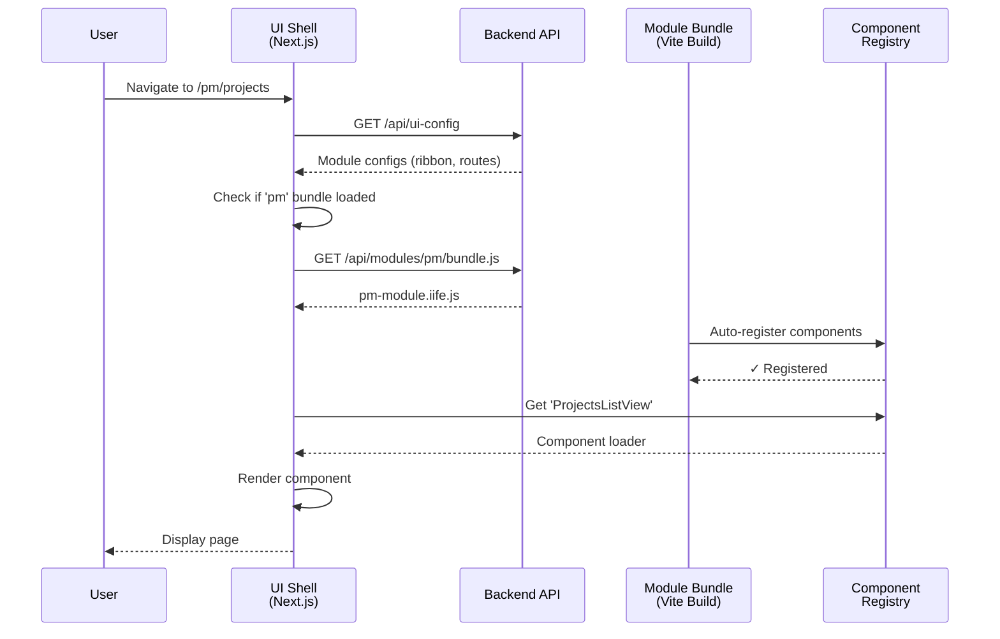
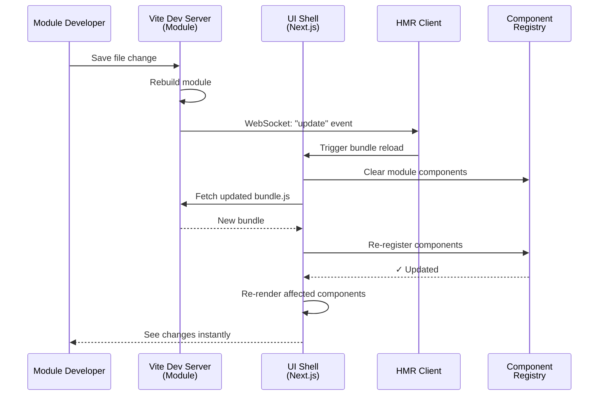

# Dynamic Module System Architecture

## Overview

The SERP platform implements a **modular, plugin-based architecture** where business modules (CRM, PM, Inventory, etc.) can be developed independently and loaded dynamically at runtime. This document explains how the UI Shell loads module UI code dynamically without requiring recompilation or redeployment.

## Key Benefits

- **🔌 Plugin Architecture**: Add/remove modules without touching the core shell
- **📦 Independent Development**: Each module has its own codebase, dependencies, and build process
- **🚀 Dynamic Loading**: Modules are loaded on-demand at runtime
- **♻️ Code Sharing**: Modules reuse shell's React, Next.js, and UI components (no duplication)
- **🎨 Consistent UX**: All modules share the same Ribbon toolbar, routing, and UI framework

---

## Architecture Components

### 1. UI Shell (`/ui-shell`)

The main Next.js application that provides:
- **Application Framework**: Next.js 14 with App Router
- **Shared Dependencies**: React, Next.js, Lucide icons, TanStack Query
- **UI Component Library**: Reusable components in `@/components/ui`
- **Module Infrastructure**:
  - Module Provider (loads module configurations)
  - Component Registry (tracks module components)
  - Module Loader (loads module bundles dynamically)
  - Ribbon Toolbar (displays module tabs and actions)

### 2. Module UI (`/modules/{module-name}/{module_name}/ui`)

Each module has an independent UI folder with:
- **`registry.ts`**: Module metadata, ribbon configuration, routes, permissions
- **`bundle-entry.tsx`**: Entry point for Vite build, component exports
- **`vite.config.ts`**: Build configuration to create standalone bundle
- **`views/`**: React components for the module's pages
- **`package.json`**: Module-specific dependencies (if needed)

---

## How It Works: Step-by-Step

### Step 1: Module Build Process

Each module UI is built independently using **Vite**:

```bash
cd modules/serp-pm/serp_pm/ui
npm run build  # or vite build
```

**What happens:**
1. Vite bundles the module code starting from [`bundle-entry.tsx`](file:///home/johan/projects/opnexo/serp/modules/serp-pm/serp_pm/ui/bundle-entry.tsx)
2. External dependencies (React, Next.js, UI components) are **NOT bundled** (marked as `external` in [`vite.config.ts`](file:///home/johan/projects/opnexo/serp/modules/serp-pm/serp_pm/ui/vite.config.ts#L38-L58))
3. The output is an **IIFE (Immediately Invoked Function Expression)** bundle at `dist/pm-module.iife.js`
4. The bundle expects global variables (`window.React`, `window.SerpUI`, etc.) to be available

**Key Vite Configuration:**

```typescript
// vite.config.ts
export default defineConfig({
  build: {
    lib: {
      entry: 'bundle-entry.tsx',
      name: 'SerpPmModule',
      formats: ['iife']  // Browser-compatible format
    },
    rollupOptions: {
      // Don't bundle these - the shell provides them
      external: ['react', 'react-dom', 'next/navigation', 'lucide-react', '@/components/ui'],
      output: {
        // Map to global variables
        globals: {
          'react': 'React',
          '@/components/ui': 'SerpUI'
        }
      }
    }
  }
});
```

### Step 2: Shell Exposes Global Dependencies

The UI Shell makes dependencies globally available via [`Providers.tsx`](file:///home/johan/projects/opnexo/serp/ui-shell/src/components/Providers.tsx#L17-L35):

```typescript
// ui-shell/src/components/Providers.tsx
if (typeof window !== 'undefined') {
  window.React = React;
  window.ReactDOM = ReactDOM;
  window.NextNavigation = NextNavigation;
  window.LucideReact = LucideReact;
  window.SerpUI = SerpUI;  // All UI components
}
```

This allows module bundles to use these libraries without bundling them, reducing bundle size and ensuring version consistency.

### Step 3: Module Configuration API

The shell fetches module configurations from [`/api/ui-config`](file:///home/johan/projects/opnexo/serp/ui-shell/src/app/api/ui-config/route.ts):

```typescript
// Response format
{
  modules: [
    {
      moduleId: 'pm',
      moduleName: 'Project Management',
      ribbon: {
        tabId: 'pm',
        tabLabel: 'Projects',
        groups: [
          {
            groupLabel: 'Projects',
            buttons: [
              {
                buttonId: 'pm-projects-list',
                label: 'All Projects',
                icon: 'List',
                action: { type: 'navigate', route: '/pm/projects' }
              }
            ]
          }
        ]
      },
      routes: [
        {
          routeId: 'pm-projects',
          path: '/pm/projects',
          component: 'ProjectsListView'  // String reference
        }
      ]
    }
  ]
}
```

The `component` field is a **string name** that will be resolved later via the component registry.

### Step 4: Module Loading at Runtime

When a user navigates to a module route (e.g., `/pm/projects`):

1. **Module Loader** ([`moduleLoader.ts`](file:///home/johan/projects/opnexo/serp/ui-shell/src/lib/modules/moduleLoader.ts)) injects a `<script>` tag:
   ```typescript
   const script = document.createElement('script');
   script.src = '/api/modules/pm/bundle.js';
   document.head.appendChild(script);
   ```

2. **Backend API** serves the bundle from the module's `dist/` folder

3. **Bundle Self-Registers** when it loads ([`bundle-entry.tsx`](file:///home/johan/projects/opnexo/serp/modules/serp-pm/serp_pm/ui/bundle-entry.tsx#L64-L79)):
   ```typescript
   // Auto-register when loaded in browser
   if (typeof window !== 'undefined') {
     const registry = window.__SERP_MODULE_REGISTRY__;
     registry.register('pm', {
       components: {
         ProjectsListView: () => Promise.resolve({ default: ProjectsListView }),
         TasksListView: () => Promise.resolve({ default: TasksListView })
       }
     });
   }
   ```

4. **Component Registry** ([`componentRegistry.ts`](file:///home/johan/projects/opnexo/serp/ui-shell/src/lib/modules/componentRegistry.ts)) stores the component loaders

### Step 5: Component Resolution

When rendering a route, the shell:

1. Looks up the route configuration (e.g., `component: 'ProjectsListView'`)
2. Checks if the module bundle is loaded
3. If not loaded, loads it using the Module Loader
4. Retrieves the component from the Component Registry
5. Dynamically imports and renders the component

```typescript
// Simplified component resolution
const componentName = route.component; // 'ProjectsListView'
const loader = componentRegistry.getComponent('pm', componentName);
const Component = await loader(); // Returns { default: ProjectsListView }
return <Component.default />;
```

---

## Data Flow Diagram



---

## Module Registry Structure

Each module defines its registry in [`registry.ts`](file:///home/johan/projects/opnexo/serp/modules/serp-pm/serp_pm/ui/registry.ts):

```typescript
export const pmModuleRegistry: ModuleRegistry = {
  moduleId: 'pm',
  moduleName: 'Project Management',
  
  // Ribbon UI configuration
  ribbon: {
    tabId: 'pm',
    tabLabel: 'Projects',
    groups: [
      {
        groupLabel: 'Projects',
        buttons: [
          {
            label: 'All Projects',
            icon: 'List',
            action: { type: 'navigate', route: '/pm/projects' }
          }
        ]
      }
    ]
  },
  
  // Route definitions
  routes: [
    {
      path: '/pm/projects',
      component: () => import('./views/ProjectsListView')  // Dynamic import
    }
  ],
  
  // Permissions
  permissions: ['pm.view', 'pm.create', 'pm.update']
};
```

---

## Ribbon Toolbar Integration

The Ribbon toolbar automatically displays tabs for all loaded modules:

1. **Module Provider** loads configurations from `/api/ui-config`
2. **Ribbon Component** ([`Ribbon.tsx`](file:///home/johan/projects/opnexo/serp/ui-shell/src/components/Ribbon/Ribbon.tsx)) renders tabs from module configs
3. Each tab shows **groups** with **action buttons**
4. Buttons can navigate, open modals, or execute commands
5. Active tab is determined by current route (e.g., `/pm/*` activates "Projects" tab)

---

## File Structure

```
serp/
├── ui-shell/                          # Main Next.js application
│   ├── src/
│   │   ├── app/
│   │   │   ├── (protected)/
│   │   │   │   ├── layout.tsx         # Includes Ribbon
│   │   │   │   └── [...slug]/         # Dynamic route handler
│   │   │   └── api/
│   │   │       └── ui-config/
│   │   │           └── route.ts       # Returns module configs
│   │   ├── components/
│   │   │   ├── Ribbon/                # Ribbon toolbar components
│   │   │   ├── Shell/                 # App shell wrapper
│   │   │   ├── Providers.tsx          # Exposes globals
│   │   │   └── ui/                    # Shared UI components
│   │   ├── lib/
│   │   │   └── modules/
│   │   │       ├── index.tsx          # ModuleProvider
│   │   │       ├── moduleLoader.ts    # Dynamic bundle loading
│   │   │       └── componentRegistry.ts # Component tracking
│   │   └── types/
│   │       └── module.ts              # TypeScript types
│   └── package.json
│
└── modules/
    └── serp-pm/                       # Project Management module
        └── serp_pm/
            ├── ui/                     # Module UI code
            │   ├── registry.ts         # Module metadata
            │   ├── bundle-entry.tsx    # Vite entry point
            │   ├── vite.config.ts      # Build config
            │   ├── package.json        # UI dependencies
            │   ├── views/              # React components
            │   │   └── ProjectsListView.tsx
            │   └── dist/               # Build output
            │       └── pm-module.iife.js
            ├── domain/                 # Backend domain logic
            ├── application/            # Backend services
            └── infrastructure/         # Backend infrastructure
```

---

## Key Principles

### ✅ DO

- **Use shell's dependencies**: Import from `window.React`, `window.SerpUI`, etc.
- **Export all components**: Make views available in `bundle-entry.tsx`
- **Follow naming conventions**: Component names must match registry entries
- **Use the registry**: Define ribbon, routes, and permissions in `registry.ts`
- **Build independently**: Each module has its own build process

### ❌ DON'T

- **Don't bundle React/Next.js**: Mark them as external in Vite config
- **Don't duplicate UI components**: Reuse shell's `@/components/ui`
- **Don't hardcode routes**: Use the registry system
- **Don't create circular dependencies**: Modules should be independent
- **Don't bypass the component registry**: Always register components

---

## Adding a New Module

### 1. Create Module UI Structure

```bash
mkdir -p modules/my-module/my_module/ui/views
cd modules/my-module/my_module/ui
```

### 2. Create Essential Files

**`package.json`**:
```json
{
  "name": "@serp/my-module-ui",
  "scripts": {
    "build": "vite build",
    "dev": "vite build --watch"
  }
}
```

**`registry.ts`**:
```typescript
export const myModuleRegistry: ModuleRegistry = {
  moduleId: 'my-module',
  moduleName: 'My Module',
  ribbon: { /* ... */ },
  routes: [ /* ... */ ],
  permissions: [ /* ... */ ]
};
```

**`bundle-entry.tsx`**:
```typescript
import MyView from './views/MyView';

export const components = {
  MyView: () => Promise.resolve({ default: MyView })
};

if (typeof window !== 'undefined') {
  window.__SERP_MODULE_REGISTRY__?.register('my-module', { components });
}
```

**`vite.config.ts`**: Copy from existing module and update module name

### 3. Build the Module

```bash
npm install
npm run build
```

### 4. Update Backend API

Add the module to `/api/ui-config` response (or configure backend to serve it)

### 5. Test

Navigate to your module's route and verify it loads correctly!

---

## Troubleshooting

### Module not loading

- Check browser console for errors
- Verify module bundle was built (`dist/` folder exists)
- Confirm `/api/modules/{module-id}/bundle.js` returns the bundle
- Check that `window.__SERP_MODULE_REGISTRY__` exists

### "Component not found" error

- Verify component name in `bundle-entry.tsx` matches route config
- Check component registry in browser: `window.__SERP_MODULE_REGISTRY__`
- Ensure bundle loaded successfully (no 404 errors)

### Style issues

- Import styles in `bundle-entry.tsx`
- Use shell's UI components for consistency
- Check Tailwind classes are available

### Bundle too large

- Verify externals are configured correctly in `vite.config.ts`
- Check that React/Next.js aren't bundled (should be <100KB)
- Use code splitting for large views

---

## Future Enhancements

- ~~**Hot Module Replacement**: Live reload modules without page refresh~~ ✅ [See below](#hot-module-replacement-hmr)
- **Version Management**: Support multiple module versions
- **Lazy Loading**: Load modules on first route access
- **Error Boundaries**: Graceful error handling for module failures
- **Module Marketplace**: Install/uninstall modules from UI
- **Module Dependencies**: Declare inter-module dependencies

---

## Hot Module Replacement (HMR)

Enable live module reloading during development so module developers can see changes instantly without full page refreshes.

### HMR Architecture Overview

The HMR system connects **Vite's dev server** running in each module to the **UI Shell** via WebSockets, enabling instant component updates when module code changes.



### HMR Components

#### 1. Vite HMR Plugin (`hmr-plugin.ts`)

Each module includes a Vite plugin that broadcasts update events:

```typescript
// modules/{module-name}/{module_name}/ui/hmr-plugin.ts
import type { Plugin } from 'vite';

export function serpHmrPlugin(moduleId: string): Plugin {
    return {
        name: 'serp-hmr',
        configureServer(server) {
            server.ws.on('connection', () => {
                console.log(`🔥 HMR connected for module: ${moduleId}`);
            });
        },
        handleHotUpdate({ server }) {
            // Broadcast custom event when files change
            server.ws.send({
                type: 'custom',
                event: 'serp:module-update',
                data: { moduleId, timestamp: Date.now() }
            });
        }
    };
}
```

#### 2. Vite Configuration for HMR

Update `vite.config.ts` to enable dev server with HMR:

```typescript
// modules/{module-name}/{module_name}/ui/vite.config.ts
import { serpHmrPlugin } from './hmr-plugin';

export default defineConfig({
    plugins: [react(), serpHmrPlugin('pm')],  // Use module ID

    server: {
        port: 5173,  // Unique per module
        hmr: {
            port: 5173,
        },
        cors: true,
    },
    // ... rest of config
});
```

**Port Assignment Convention:**
| Module | Port |
|--------|------|
| PM     | 5173 |
| CRM    | 5174 |
| Invoicing | 5175 |

#### 3. HMR Client (`hmrClient.ts`)

The UI Shell connects to each module's Vite dev server:

```typescript
// ui-shell/src/lib/modules/hmrClient.ts
class HmrClient {
    private connections = new Map<string, WebSocket>();
    
    connect(moduleId: string, port: number) {
        if (process.env.NODE_ENV !== 'development') return;
        
        const ws = new WebSocket(`ws://localhost:${port}`);
        
        ws.onmessage = (event) => {
            const data = JSON.parse(event.data);
            if (data.event === 'serp:module-update') {
                this.handleModuleUpdate(data.data.moduleId);
            }
        };
        
        ws.onclose = () => {
            // Reconnect after delay
            setTimeout(() => this.connect(moduleId, port), 3000);
        };
        
        this.connections.set(moduleId, ws);
    }
    
    private handleModuleUpdate(moduleId: string) {
        console.log(`🔥 Hot updating module: ${moduleId}`);
        moduleLoader.hotReload(moduleId);
    }
    
    disconnect(moduleId: string) {
        this.connections.get(moduleId)?.close();
        this.connections.delete(moduleId);
    }
}

export const hmrClient = new HmrClient();
```

#### 4. Module Loader Hot Reload

The module loader supports reloading bundles without page refresh:

```typescript
// ui-shell/src/lib/modules/moduleLoader.ts
class ModuleLoader {
    // ... existing methods ...
    
    /**
     * Hot reload a module bundle (development only)
     */
    async hotReload(moduleId: string): Promise<boolean> {
        console.log(`🔥 Hot reloading module: ${moduleId}`);
        
        // Clear existing registration
        this.unload(moduleId);
        componentRegistry.clear(moduleId);
        
        // Load fresh bundle with cache-bust parameter
        const timestamp = Date.now();
        return this.loadBundleWithCacheBust(moduleId, timestamp);
    }
    
    private async loadBundleWithCacheBust(moduleId: string, timestamp: number): Promise<boolean> {
        return new Promise((resolve) => {
            const script = document.createElement('script');
            script.src = `/api/modules/${moduleId}/bundle.js?t=${timestamp}`;
            script.async = true;
            
            script.onload = () => {
                this.loadedBundles.add(moduleId);
                document.head.removeChild(script);
                resolve(true);
            };
            
            script.onerror = () => {
                document.head.removeChild(script);
                resolve(false);
            };
            
            document.head.appendChild(script);
        });
    }
}
```

#### 5. Component Registry Updates

The registry emits events when components are updated:

```typescript
// ui-shell/src/lib/modules/componentRegistry.ts
class ComponentRegistry {
    private listeners = new Set<(moduleId: string) => void>();
    
    /**
     * Subscribe to module update events
     */
    onModuleUpdate(callback: (moduleId: string) => void) {
        this.listeners.add(callback);
        return () => this.listeners.delete(callback);
    }
    
    register(moduleId: string, componentName: string, loader: ComponentLoader) {
        // ... existing registration logic ...
        
        // Notify listeners of update
        this.listeners.forEach(cb => cb(moduleId));
    }
}
```

#### 6. React Hook for HMR

Components use a hook that re-renders on hot updates:

```typescript
// ui-shell/src/lib/modules/useModuleComponent.ts
import { useState, useEffect, useReducer, ComponentType } from 'react';
import { componentRegistry } from './componentRegistry';
import { moduleLoader } from './moduleLoader';

export function useModuleComponent(
    moduleId: string, 
    componentName: string
): ComponentType | null {
    const [Component, setComponent] = useState<ComponentType | null>(null);
    const [updateTrigger, forceUpdate] = useReducer(x => x + 1, 0);
    
    useEffect(() => {
        // Subscribe to hot updates for this module
        const unsubscribe = componentRegistry.onModuleUpdate((updatedId) => {
            if (updatedId === moduleId) {
                console.log(`🔥 Component update detected: ${moduleId}/${componentName}`);
                forceUpdate();
            }
        });
        
        return unsubscribe;
    }, [moduleId, componentName]);
    
    useEffect(() => {
        async function loadComponent() {
            await moduleLoader.ensureBundleLoaded(moduleId);
            const loader = componentRegistry.getComponent(moduleId, componentName);
            if (loader) {
                const module = await loader();
                setComponent(() => module.default);
            }
        }
        
        loadComponent();
    }, [moduleId, componentName, updateTrigger]);
    
    return Component;
}
```

### Running Modules with HMR

During development, run both the UI Shell and module dev servers:

```bash
# Terminal 1: Start UI Shell
cd ui-shell
npm run dev

# Terminal 2: Start PM module with HMR
cd modules/serp-pm/serp_pm/ui
npm run dev  # Runs Vite dev server on port 5173
```

### HMR Workflow

1. **Developer saves a file** in the module (e.g., `ProjectsListView.tsx`)
2. **Vite detects the change** and rebuilds the module bundle
3. **Vite plugin sends** a `serp:module-update` event via WebSocket
4. **HMR Client receives** the event in the UI Shell
5. **Module Loader clears** the old bundle and loads the new one
6. **Component Registry** notifies all subscribers
7. **React components re-render** with the updated code
8. **Developer sees changes** instantly without losing page state

### Troubleshooting HMR

**WebSocket connection failed:**
- Ensure the Vite dev server is running
- Check the correct port is configured
- Verify no firewall blocking WebSocket connections

**Components not updating:**
- Check browser console for HMR messages
- Verify the module ID matches in plugin and registry
- Clear browser cache and reload

**State lost on update:**
- React state is preserved during HMR
- If state is lost, the component may have a key change
- Check for component identity issues


## Related Documentation

- [Module Types](file:///home/johan/projects/opnexo/serp/ui-shell/src/types/module.ts) - TypeScript type definitions
- [Ribbon Components](file:///home/johan/projects/opnexo/serp/ui-shell/src/components/Ribbon) - Ribbon toolbar implementation
- [PM Module Example](file:///home/johan/projects/opnexo/serp/modules/serp-pm/serp_pm/ui) - Complete working module

---

**Last Updated**: 2026-01-24  
**Maintained By**: SERP Development Team
